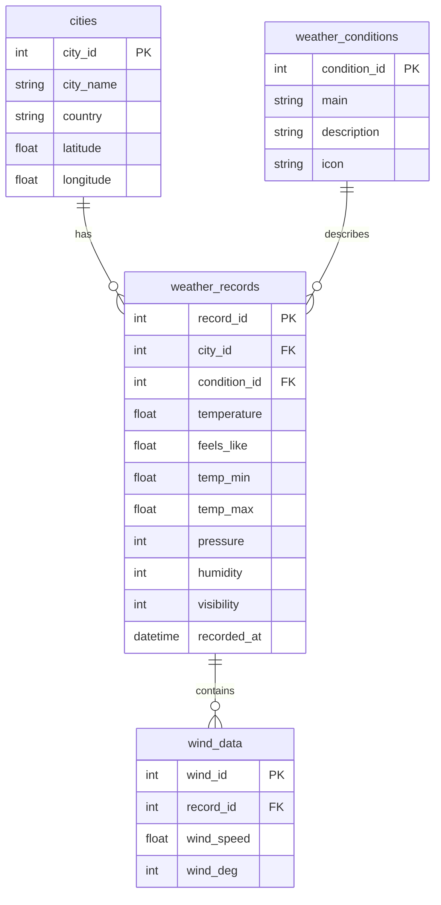

# 🌦 Real-Time Weather Data Management

## 📌 Overview

This project collects **real-time weather data** from the [OpenWeatherMap API](https://openweathermap.org/api), stores it in **Supabase (PostgreSQL)**, and optionally exports it to **MySQL** for advanced SQL analysis. Automation is handled with **GitHub Actions**, enabling the data pipeline to run 24/7 without keeping your laptop on.

---

## 🚀 Features

* 🌍 Fetches live weather data for **20 major cities worldwide**.
* 🗄 Stores data in **normalized PostgreSQL tables** (Cities, Weather Conditions, Weather Records, Wind Data).
* ⏳ Automated **every 15 minutes** via GitHub Actions.
* 📊 Data export in **CSV format** from Supabase.
* 🛠 Easy import into **MySQL** for joins, aggregations, and portfolio-ready projects.
* ⚡ Scalable & serverless — no dedicated server required.

---

## 🗂 Database Structure



---

## ⚙️ Tech Stack

* Python (Data extraction & processing)
* Supabase (PostgreSQL cloud database)
* MySQL (Optional for advanced SQL queries)
* GitHub Actions (Automation)
* OpenWeatherMap API (Data source)

---

## 🛠 Setup Instructions

1. **Clone the repository:**

```bash
git clone https://github.com/YourUsername/weather-data-management.git
cd weather-data-management
```

2. **Install dependencies:**

```bash
pip install -r requirements.txt
```

3. **Configure environment variables:**
   Create a `.env` file:

```ini
API_KEY=your_openweathermap_api_key
SUPABASE_URL=your_supabase_url
SUPABASE_KEY=your_supabase_api_key
```

4. **Run locally:**

```bash
python insert_records.py
```

---

## 🤖 GitHub Actions Automation

Create `.github/workflows/weather-data.yml`:

```yaml
name: Weather Data Collector

on:
  schedule:
    - cron: "*/15 * * * *"  # Runs every 15 minutes
  workflow_dispatch:

jobs:
  collect:
    runs-on: ubuntu-latest
    steps:
      - name: Checkout repository
        uses: actions/checkout@v3

      - name: Set up Python
        uses: actions/setup-python@v4
        with:
          python-version: "3.10"

      - name: Install dependencies
        run: pip install -r requirements.txt

      - name: Run data collector
        env:
          API_KEY: ${{ secrets.OPENWEATHER_API_KEY }}
          SUPABASE_URL: ${{ secrets.SUPABASE_URL }}
          SUPABASE_KEY: ${{ secrets.SUPABASE_KEY }}
        run: python insert_records.py
```

---

## 📤 Exporting Data to CSV from Supabase

1. Go to **Supabase → Table Editor**.
2. Select your table.
3. Click the **... menu → Export Data → CSV**.

---

## 📥 Importing CSV into MySQL

```sql
LOAD DATA LOCAL INFILE '/path/to/weather_records.csv'
INTO TABLE weather_records
FIELDS TERMINATED BY ','
ENCLOSED BY '"'
LINES TERMINATED BY '\n'
IGNORE 1 LINES;
```

---

## 📊 Example Use Cases

* Real-time weather dashboards
* City-wise weather analytics
* Trend analysis (temperature, humidity, etc.)
* Integration with Power BI or Tableau

---

## 📜 License

MIT License — free to use and modify.

---

👤 **Author:** Your Name — Data Analyst
📧 [your.email@example.com](mailto:your.email@example.com)
💼 LinkedIn | 🐙 GitHub
